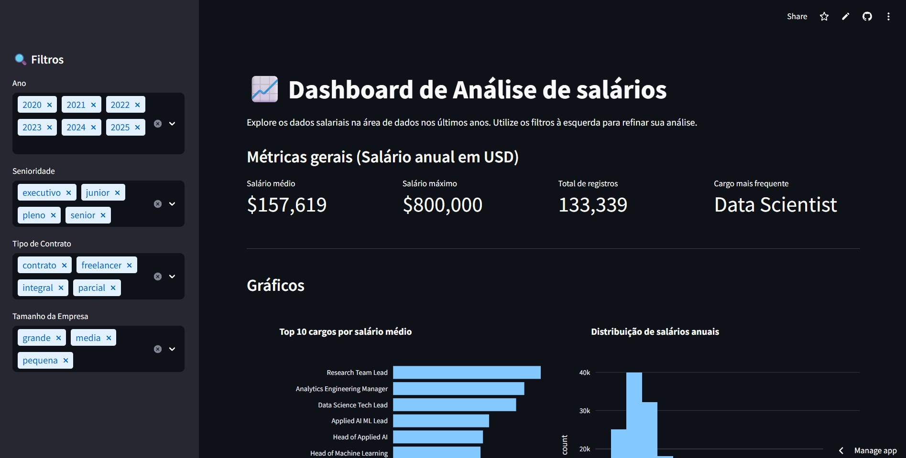
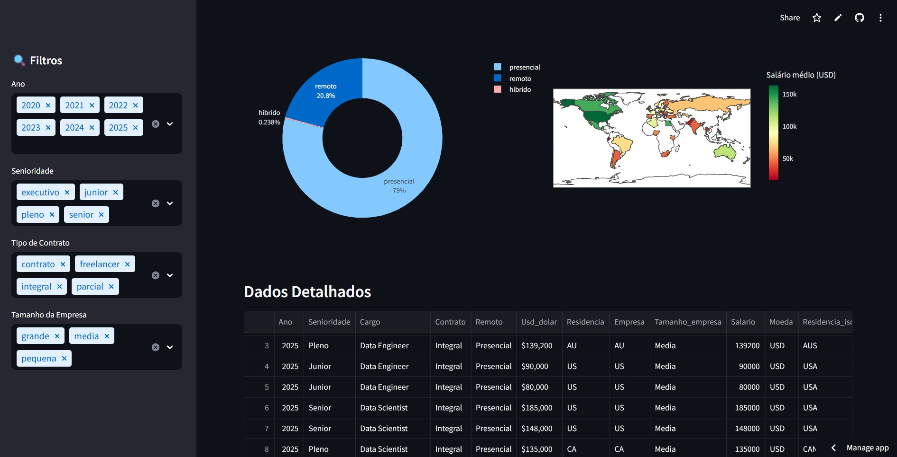

# 📊 Dashboard de salários

Este projeto foi desenvolvido durante a imersão de dados com Python da Alura, com o objetivo de explorar e visualizar informações de salário para a área de análise de dados. Utilizando bibliotecas como Pandas, NumPy, PyCountry, Seaborn, Matplotlib e Plotly Express, criei um dashboard interativo que permite filtrar e analisar dados.

## Funcionalidades
- Filtrar por ano, senioridade, tipo de contrato e tamanho da empresa.
- Visualização de KPI's como salário médio, salário máximo, total de registros e cargo mais frequente.
- Explorar gráficos interativos de barras, histograma, pizza, mapa de calor e tabela para diferentes análises.
- Navegar pelos dados de forma intuitiva e dinâmica.

## Tecnologias Utilizadas
- Python
- Pandas
- NumPy
- PyCountry
- Seaborn
- Matplotlib
- Plotly Express
- Streamlit

## Objetivo do Projeto
- Praticar manipulação de dados.
- Visualizações interativas.
- Criação de dashboards.

🔗 Dashboard Online: https://dashboard-de-salarios-nataly-lucon.streamlit.app/
